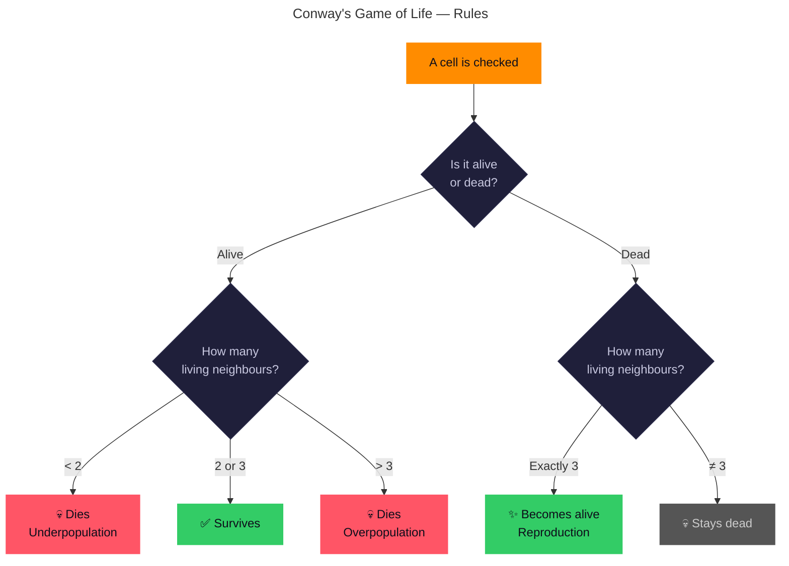

# Conway's Game of Life

<p align="center">
  
  
  
  
</p>

<p align="center">
  
</p>

A polished, single-file implementation of **Conway's Game of Life** — a zero-player cellular automaton where cells live, die, and reproduce according to four simple rules. Built with an HTML5 Canvas, dark theme, and orange glow aesthetics.

**[→ Live Demo](https://your-username.github.io/conway-gol/)**

---

## Features

- **Interactive Canvas** — Click or drag to toggle cells alive/dead
- **Play/Pause** — Run the simulation at adjustable speed
- **Step Mode** — Advance one generation at a time
- **Grid Sizes** — Small (30×20), Medium (60×40), Large (90×60)
- **Preset Patterns** — Glider, Pulsar, Beacon, Blinker, Gosper Glider Gun
- **Random Fill** — Seeds the grid with a random 25% density
- **Clear Grid** — Reset to empty
- **Stats Display** — Generation counter and live cell count
- **Speed Slider** — 10 levels from slow to fast
- **Keyboard Shortcuts** — Space (play/pause), S (step), C (clear), R (random)
- **Dark Theme** — Orange glow on living cells, responsive layout
- **Zero Dependencies** — No external libraries, CDNs, or frameworks
- **GitHub Pages Ready** — Deploy by pushing to `gh-pages` branch

---

## Game Rules

The state of each cell in the next generation is determined by four simple rules:



| # | Rule | Result |
|---|------|--------|
| 1 | Any live cell with **fewer than 2** living neighbours | Dies (underpopulation) |
| 2 | Any live cell with **2 or 3** living neighbours | Lives on |
| 3 | Any live cell with **more than 3** living neighbours | Dies (overpopulation) |
| 4 | Any dead cell with **exactly 3** living neighbours | Becomes alive (reproduction) |

---

## Patterns Included

| Pattern | Type | Period | Description |
|---------|------|--------|-------------|
| **Glider** | Spaceship | 4 | Diagonal-moving pattern, the classic "life form" |
| **Pulsar** | Oscillator | 3 | Symmetric 13×13 pattern, 48 live cells |
| **Beacon** | Oscillator | 2 | Small 4×4 two-state oscillator |
| **Blinker** | Oscillator | 2 | The simplest oscillator — 3 cells in a line |
| **Gosper Glider Gun** | Gun | 30 | Produces gliders indefinitely (first discovered gun) |

---

## Usage

1. Open `index.html` in any modern browser — no build step, no server required.
2. **Click** on cells to toggle them alive (orange) or dead.
3. Click **Play** (or press **Space**) to start the simulation.
4. Use the **Speed** slider to control simulation rate.
5. Select a **Grid size** or **Pattern** to experiment.

### Keyboard Shortcuts

| Key | Action |
|-----|--------|
| `Space` | Play / Pause |
| `S` | Step one generation |
| `C` | Clear grid |
| `R` | Random fill |

---

## File Structure

```
conway-gol/
├── index.html          # Single-file application (~25 KB)
├── README.md           # This file
└── media/              # (optional) screenshots
    └── screenshot.png
```

---

## Deployment

### GitHub Pages

```bash
git clone https://github.com/your-username/conway-gol.git
cd conway-gol
git checkout -b gh-pages
git push origin gh-pages
```

Then enable GitHub Pages from the `gh-pages` branch in your repository settings.

### Local

Simply open `index.html` in a browser — no server required.

---

## License

MIT License — see [LICENSE](LICENSE) for details.

---

<p align="center">
  <sub>Built with ❤️ and cellular automata • Inspired by John Conway (1937–2020)</sub>
</p>
